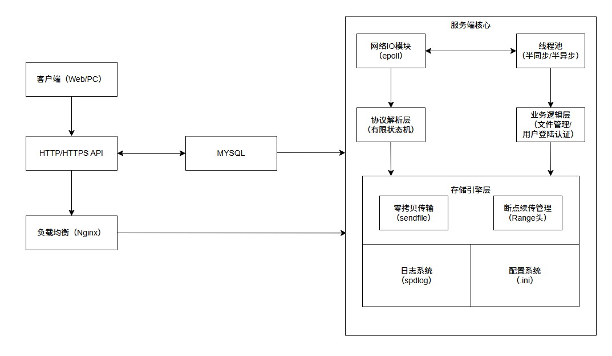
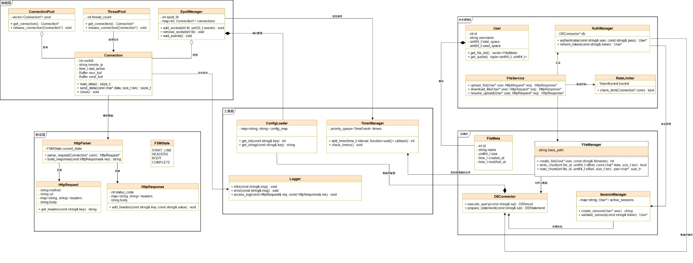

# NetDisk设计文档

## 1.整体概况

### 1.IO处理模块

使用 `epoll(LT模式)`，配合非阻塞***IO***更稳定，控制粒度更细

### 2.事件处理方式

使用`Reactor`模式 + 线程池

主线程负责`epoll`事件分发

工作线程池处理业务逻辑（使用生产者-消费者队列？？？）

### 3.并发模式

使用 **半同步/半异步模型**：***IO***线程收集数据，线程池处理业务逻辑（领导者/追随者较复杂）

### 4.应用层协议的解析

`HTTP`协议 + 使用**有限状态机（FSM）**解析应用层协议

### 5.池的使用

**线程池**：逻辑处理模块（避免频繁创建、销毁线程）

**网络连接池**：`keep-alive`，`HTTP`连接复用

**数据库连接池**：数据库连接（连接复用）

**内存池**：可选项，用于管理频繁小块内存分配

**定时器池**：可选项，管理文件超时删除、连接超时

### 6.零拷贝

下载：使用`sendfile`或 `mmap`+`writev`实现

上传：`splice`配合**管道**减少内核拷贝

文件大小 > 10KB 时使用（小文件用普通***IO***避免上下文切换）

减少 CPU 占用，避免数据在用户空间和内核空间来回拷贝

### 7.定时器

心跳检测：检测长时间无响应的连接

限速控制：每100ms发送固定数据量（可选）

超时重传：下载/上传超时处理

文件自动清理、临时链接过期等

时间轮实现（或时间堆）

### 8.断点续传

使用 HTTP的`Range` 字段协议或自定义字段，记录上次下载的位置

服务端存储用户断点信息（如：`<user_id, file_id, offset>`）

客户端断线重连后附带偏移量

### 9.用户登陆

使用数据库（如 MySQL）存储用户信息（加盐哈希密码）

使用 `bcrypt` 或 `PBKDF2` 存储密码

### 10.日志

使用开源日志库`spdlog`

分级记录（INFO、ERROR、DEBUG......）

日志文件每日滚动、按大小分片

日志文件分类：

- 访问日志：时间、IP、请求路径、状态码
- 错误日志：连接异常、DB错误
- 审计日志：用户操作（上传/删除）

### 11.设置

使用 `.ini`格式文件读取设置

配置项：端口号、数据库连接串、文件存储路径

## 2.项目目录结构

```tex
cloud_drive/
├── CMakeLists.txt
├── src/
│   ├── main.cpp            # 服务器入口
│   ├── server/             # 核心模块
│   │   ├── Server.h
│   │   ├── Server.cpp
│   │   ├── Epoll.h
│   │   ├── Epoll.cpp
│   │   ├── RequestHandler.h
│   │   ├── RequestHandler.cpp
│   │   ├── FSMParser.h
│   │   ├── FSMParser.cpp
│   ├── threadpool/         # 线程池
│   │   ├── ThreadPool.h
│   │   ├── ThreadPool.cpp
│   ├── timer/              # 定时器管理
│   │   ├── TimerManager.h
│   │   ├── TimerManager.cpp
│   ├── db/                 # 数据库模块
│   │   ├── DBManager.h
│   │   ├── DBManager.cpp
│   ├── storage/            # 文件存储模块
│   │   ├── FileManager.h
│   │   ├── FileManager.cpp
│   ├── utils/              # 日志、配置等工具
│   │   ├── Logger.h
│   │   ├── Logger.cpp
│   │   ├── Config.h
│   │   ├── Config.cpp
├── include/                # 公共头文件
├── tests/                  # 单元测试
├── docs/                   # 文档
│   ├── design.md           # 设计说明
│   └── protocol.md         # 协议格式
└── scripts/                # 启动脚本、迁移脚本等
```

## 3.架构图



## 4.类图

### 1.类图



### 2.类图关系详细说明

1. **网络层核心关系**
    - `EpollManager` 管理多个 `Connection`（组合关系）
    - `ConnectionPool` 维护可复用的连接对象（对象池模式）
    - `ThreadPool` 处理连接上的任务（生产者-消费者模式）
2. **协议处理流程**
    - `Connection` 接收到数据后交给 `HttpParser`（依赖注入）
    - `HttpParser` 使用有限状态机(FSM)生成 `HttpRequest` 对象
    - 处理完成后 `HttpParser` 构建 `HttpResponse` 对象
3. **业务逻辑交互**
    - FileService协调各模块完成核心功能：
        - 通过 `AuthManager` 验证身份
        - 通过 `FileManager` 执行文件操作
        - 使用 `RateLimiter` 进行流量控制
    - `AuthManager` 使用会话管理和数据库验证
4. **数据存储**
    - 分层存储设计：
        - `FileManager` 处理物理文件操作（带断点续传支持）
        - `DBConnector` 管理元数据和用户信息（SQL抽象层）
        - `SessionManager` 维护用户会话状态
5. **支持系统**
    - `Logger`：分级日志记录（访问日志+错误日志）
    - `ConfigLoader`：集中管理配置（端口、路径等）
    - `TimerManager`：处理超时连接和定期任务
